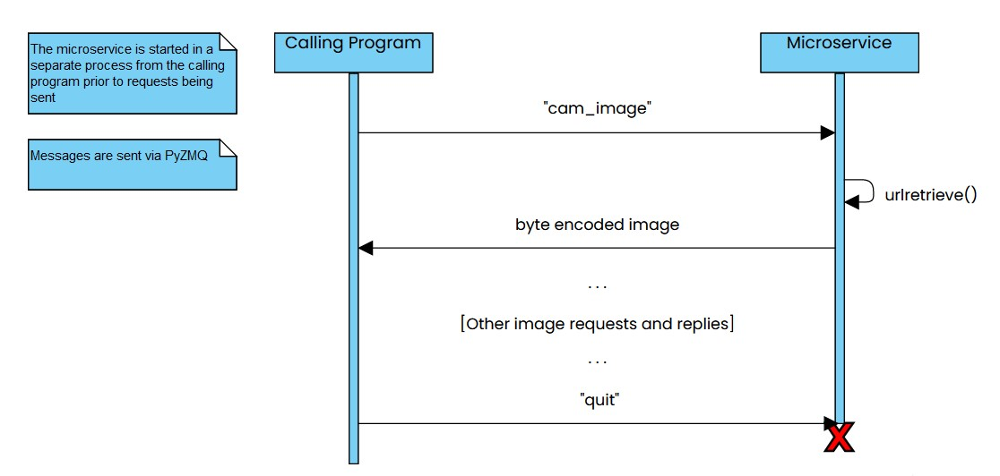

# Image Fetching Microservice
## About:
This is a microservice I wrote for a classmate's project for a 
software engineering class.
While this microservice is running, a program can send a request to it.
The microservice will download an image from the web and send it 
back to the program that requested it.  Its intended use is to fetch 
the latest image from a webcam for display in a surfing app.  

## Starting the microservice
The microservice can be run with the command `Python microservice.py`.
It is recommended that the process that will use the microservice 
start the microservice, e.g., with the `subprocess` module.  Example:
```
subprocess.Popen("Python microservice.py")
```

## Requesting data:
Send the byte encoded string message "cam_image".  Example:

```
# set up PyZMQ socket

...

socket.send(b'cam_image')
```
Note: The calling program must wait for a response before sending another
request.

## Receiving data:
The image is sent back byte encoded in a PyZMQ message.  It can be
saved as a .jpg file by writing the bytes to a file.
Example:
```
# set up PyZMQ socket

...

image = socket.recv()
f = open("IMAGE_SAVE_LOCATION.jpg", 'wb')
byte_encoded_image = bytearray(image)
f.write(byte_encoded_image)
f.close()
```

## Stopping the microservice
Sending a byte encoded string message "quit" will cause the 
microservice to terminate.

## UML Sequence Diagram:



## Dependencies:
microservice.py requires the PyZMQ library.  `pip install pyzmq`
should do the trick. All other Python libraries
it uses should be included in most installations of Python.  This 
includes the `os`, `shutil`, `pathlib`, and `urllib.requests` modules.
